<p align="center">
 
</p>

<div align="center">
 <h1> Lumina-DiMOO: An Omni Diffusion Large Language Model for Multi-Modal Generation and Understanding </h1>

  [[📑 Technical Report ](http://arxiv.org/abs/2510.06308)] &emsp; [[🌐 Project Page (Demo & Benchmark)](https://synbol.github.io/Lumina-DiMOO/)] &emsp; [[🤗 Model ](https://huggingface.co/Alpha-VLLM/Lumina-DiMOO)]
 
 <b>¹Shanghai AI Laboratory, ²Shanghai Innovation Institute, ³Shanghai Jiao Tong University, ⁴Nanjing University </b>
 
 <b>⁵The University of Sydney, ⁶The Chinese University of Hong Kong, ⁷Tsinghua University</b>

 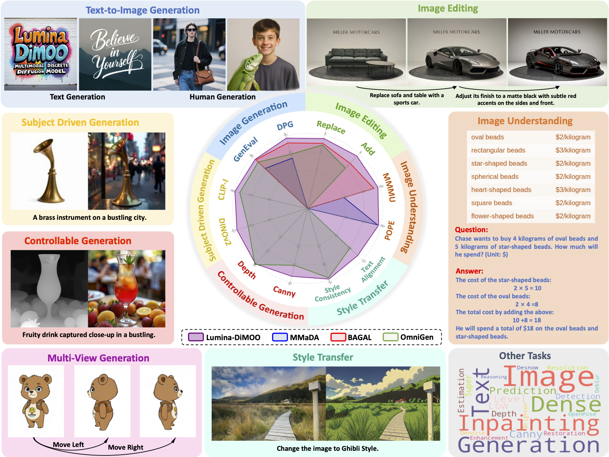
</div>

## 📚 Introduction 
We introduce Lumina-DiMOO, an omni foundational model for seamless multimodal generation and understanding. Lumina-DiMOO is distinguished by four key innovations:

 - **Unified Discrete Diffusion Architecture:** Lumina-DiMOO sets itself apart from prior unified models by utilizing a fully discrete diffusion modeling to handle inputs and outputs across various modalities.
 - **Versatile Multimodal Capabilities:** Lumina-DiMOO supports a broad spectrum of multimodal tasks, including text-to-image generation (allowing for arbitrary and high-resolution), image-to-image generation (e.g., image editing, subject-driven generation, and image inpainting, etc.), alongside advanced image understanding.

 - **Higher Sampling Efficiency:** Compared to previous AR or hybrid AR-diffusion paradigms, Lumina-DiMOO demonstrates remarkable sampling efficiency. Additionally, we design a bespoke caching method to further speed up the sampling speed by 2x.

 - **Superior Performance:** Lumina-DiMOO achieves state-of-the-art performance on multiple benchmarks, surpassing existing open-source unified multimodal models, setting a new standard in the field.


   
 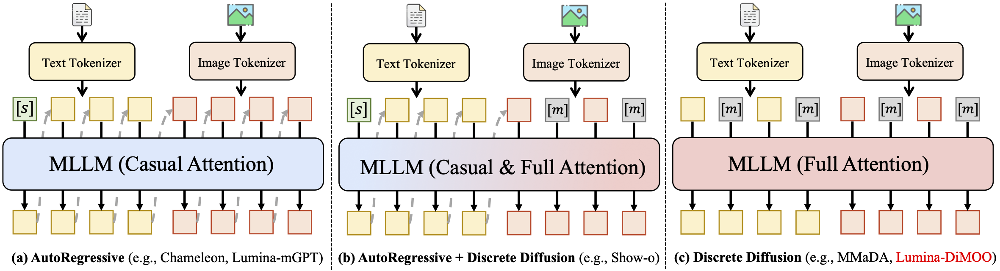


## 🔥 News
- **[2025-10-06]** Training code is released.
- **[2025-09-25]** We have released the Technical Report.
- **[2025-09-20]** 🎉 In the latest [UniGenBench Leaderboard](https://huggingface.co/spaces/CodeGoat24/UniGenBench_Leaderboard)(maintained by Tencent Hunyuan Team), Lumina-DiMOO's generation evaluation ranks 1st 🥇 among all open-source unified models. 
- **[2025-09-12]** We have open-sourced Image Inpainting & Extrapolation code.
- **[2025-09-11]** We have open-sourced the Max Logit-based Cache solution, offering a 2x speed improvement for sampling.
- **[2025-09-10]** 🎉 We release the initial version of **Lumina-DiMOO**, including:
  - 🎯 Model Checkpoints on [HuggingFace](https://huggingface.co/Alpha-VLLM/Lumina-DiMOO)!
  - 🎯 Text-to-Image & Image-to-Image Generation Inference code!
  - 🎯 Image Understanding Inference Code!
  - 🎯 Website & Demo on [Project Page](https://synbol.github.io/Lumina-DiMOO/)!

## 📝 Open-Source Plan
 - [x] Image Inpainting & Extrapolation Code
 - [x] Fast Sampling with Max Logit-based Cache
 - [ ] Gradio Demo
 - [ ] Bechmark Evaluation Code
 - [x] Fine-Tuning Code
 - [ ] Self-GRPO Training Code
 - [x] Technical Report

## 📽️ Qualitative Results
Here we present some comparative generation results with other models. **For additional visualization results, please see our [Project Page](https://synbol.github.io/Lumina-DiMOO/).**
<details open>
  <summary>Text-to-Image Comparison</summary>
  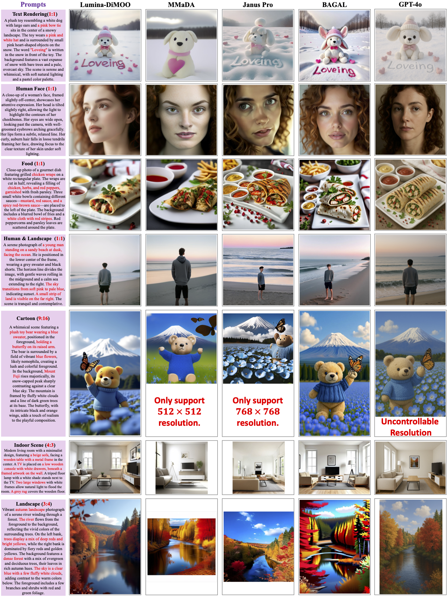
<!--   <details open>
  <summary>Effects of Max Logit-Based Cache (A800 GPU, 1536x768 resolution)</summary>
  Without Cache: Latency: 58.2 s; Peak GPU Memory: 38.9 GiB
  


  With Cache: Latency: 32.2 s; Peak GPU Memory: 45.9 GiB
  
</details> -->
</details>

<details close>
  <summary>Image Editing Comparison</summary>
  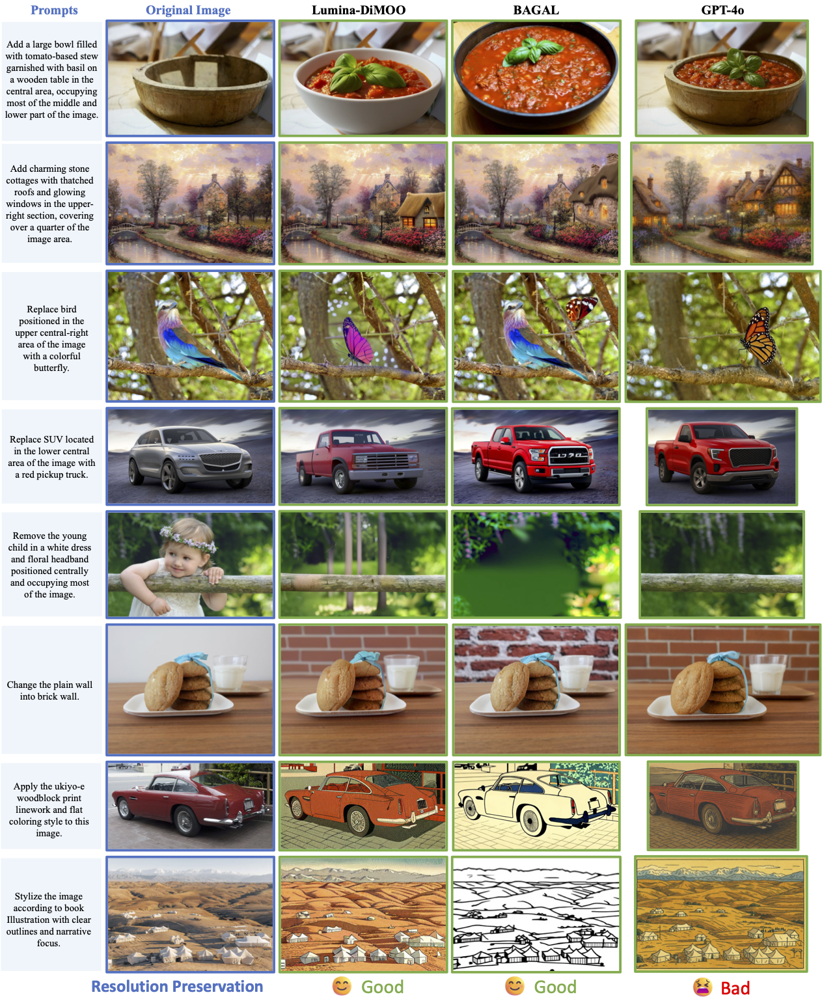
</details>

<details close>
  <summary>Controllable & Subject-Driven Generation Comparison</summary>
  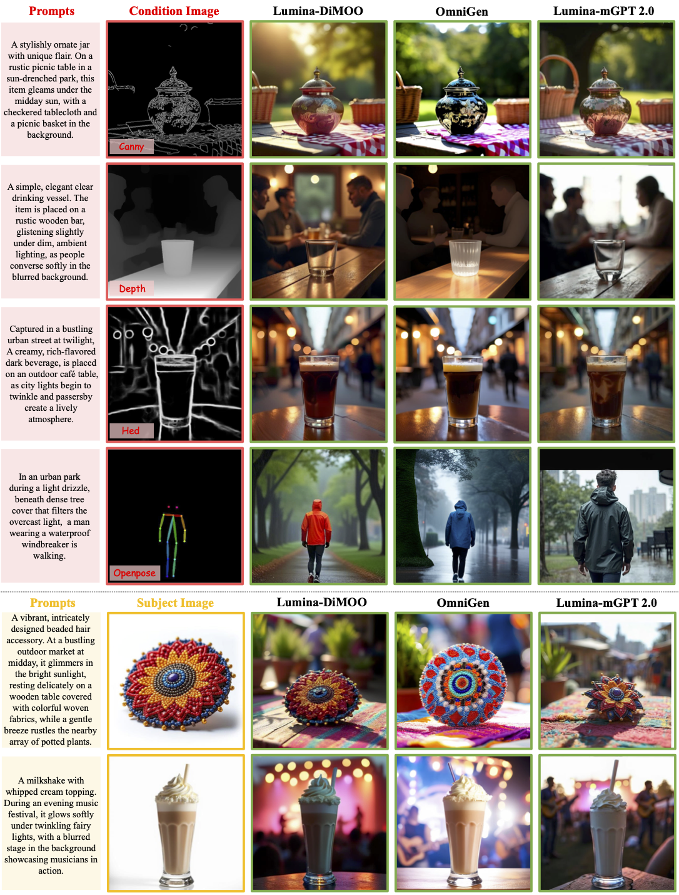
</details>

<details close>
  <summary>Image Inpainting & Extrapolation</summary>
  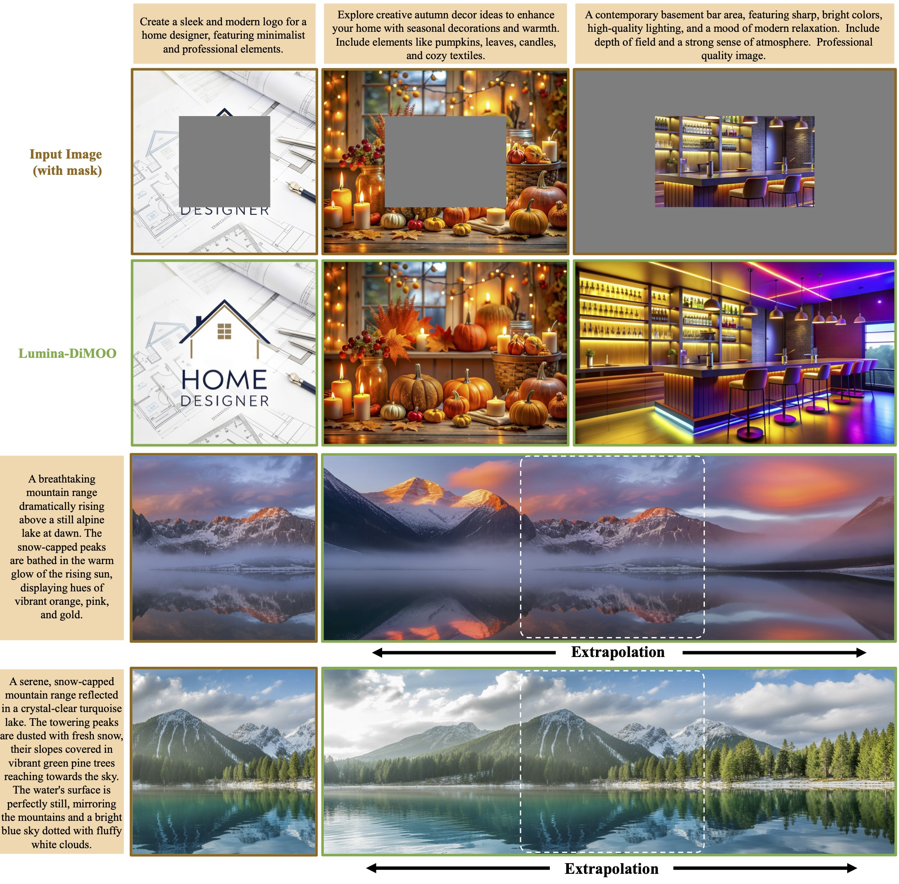
</details>


## 📊 Quantitative Performance
<details open>
  <summary>GenEval Benchmark</summary>
  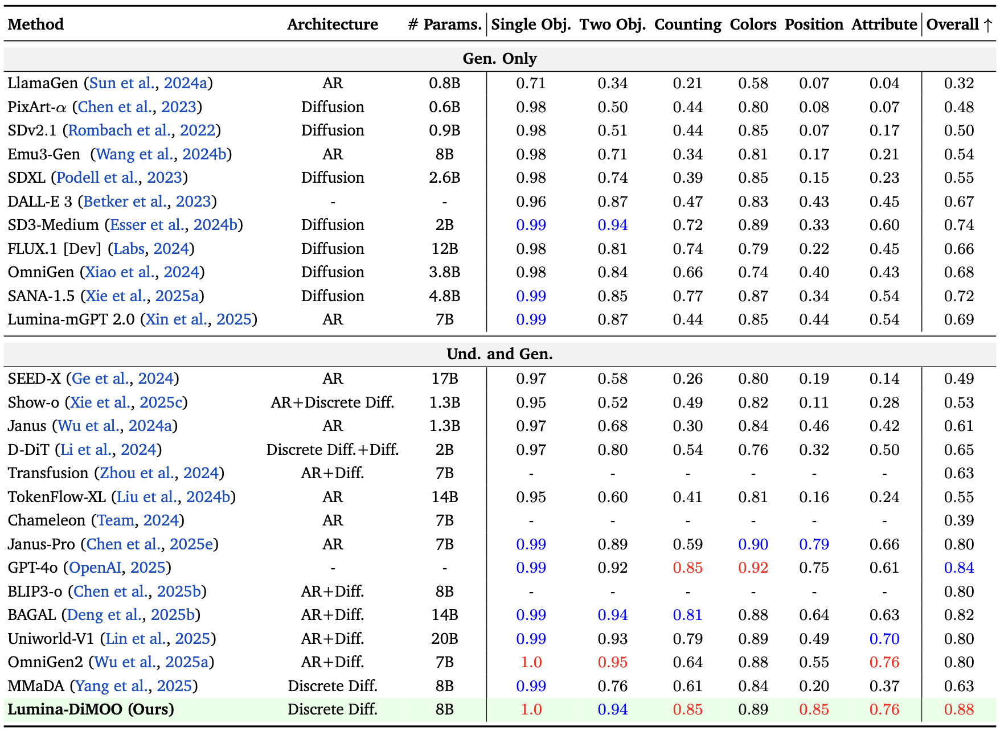
</details>


<details close>
  <summary>DPG Benchmark</summary>
  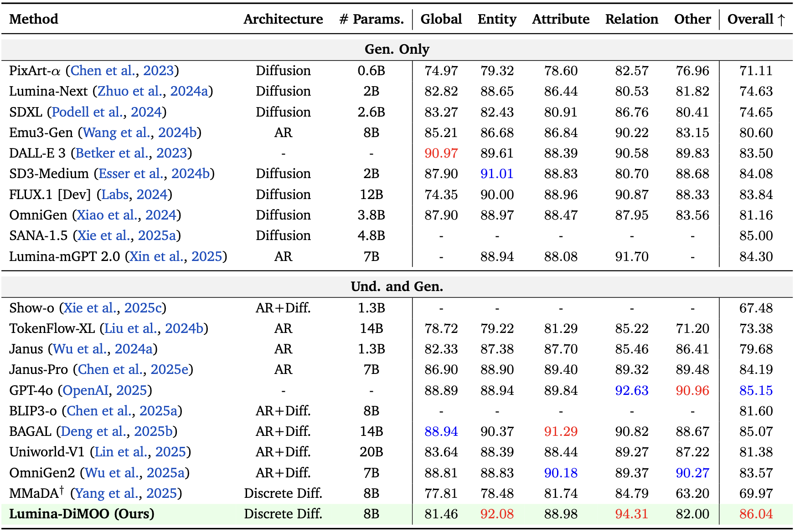
</details>

<details close>
  <summary>OneIG-EN Benchmark</summary>
  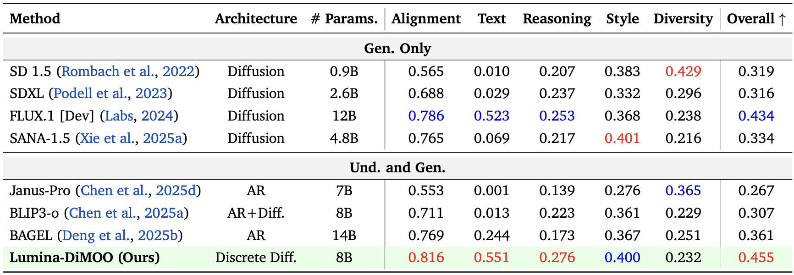
</details>


<details close>
  <summary>TIIF Benchmark</summary>
  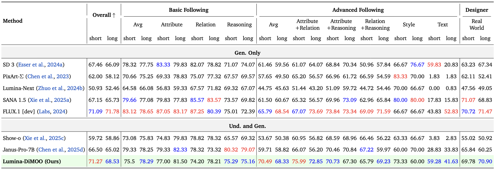
</details>

<details close>
  <summary>Image-to-Image Benchmark</summary>
  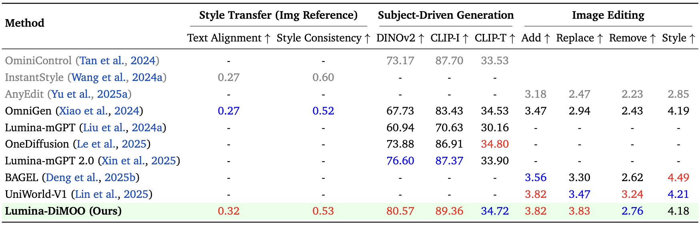
</details>

<details close>
  <summary>Image Understanding Benchmark</summary>
  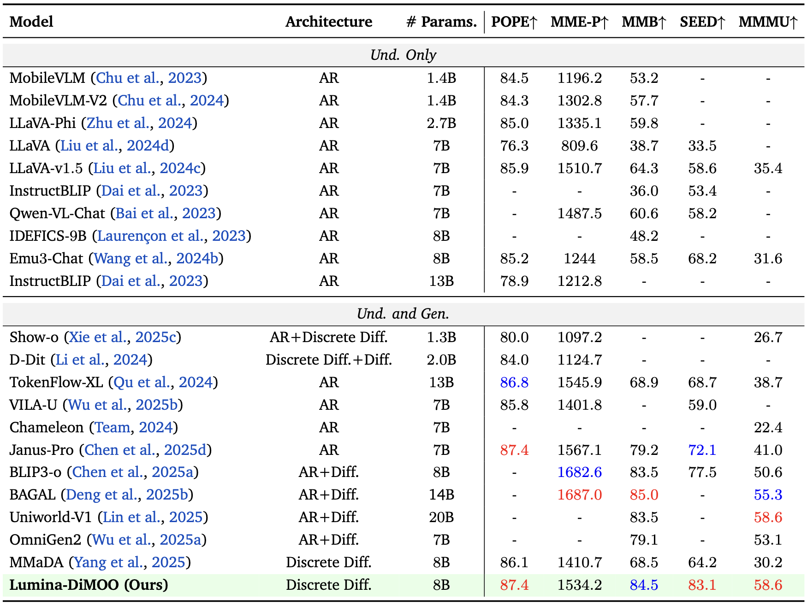
</details>

## 🚀 Sampling Speed Analysis
- Since text generation is performed in a block-wise manner, unlike image generation which uses a single global decoding step, its speed is influenced by both the number of blocks and the number of steps. Therefore, the speed improvement of image understanding is not as significant as that of image generation.

- **Lumina-DiMOO Settings**: For image generation, we sample 64 steps. For image understanding, we set the block length to 256 and the number of sampling steps to 128.

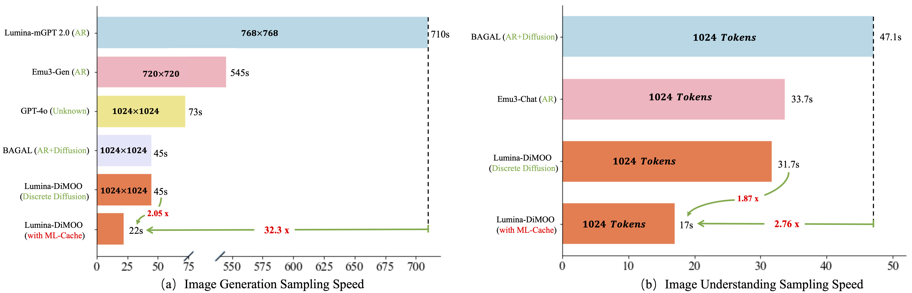


## 📌 Quick Start
### ⚙️ Installation
#### 1. Create a conda environment
```
git clone https://github.com/Alpha-VLLM/Lumina-DiMOO.git && cd Lumina-DiMOO
conda create -n lumina_dimoo python=3.10 -y
conda activate lumina_dimoo
```
#### 2. Install  dependencies
```
pip install -r requirements.txt
```

### 🧨 How to Fine-Tuning Lumina-DiMOO
#### Step 1: Pre-extract discrete codes of training images.
The final format after specific processing can refer to the sample json file ``assets/mmu_sample.json`` and ``assets/t2i_sample.json``.
```
bash pre_tokenizer/run_pre_token.sh
```
#### Step 2: Train Lumina-DiMOO model.
```
bash train/train.sh
```

### 🚗 Text-to-Image Generation Inference
#### 1. Normal Sampling
```
python inference/inference_t2i.py\
    --checkpoint Alpha-VLLM/Lumina-DiMOO \
    --prompt "A striking photograph of a glass of orange juice on a wooden kitchen table, capturing a playful moment. The orange juice splashes out of the glass and forms the word \"Smile\" in a whimsical, swirling script just above the glass. The background is softly blurred, revealing a cozy, homely kitchen with warm lighting and a sense of comfort." \
    --height 768 \
    --width 1536 \
    --timesteps 64 \
    --cfg_scale 4.0 \
    --seed 65513 \
    --vae_ckpt Alpha-VLLM/Lumina-DiMOO \
    --output_dir output/results_text_to_image
```
#### 2. DDP Sampling
To support large-scale sampling/testing, we provide additional ddp sampling scripts that support multi-GPU parallel sampling.
```
torchrun --nproc_per_node=8 inference/inference_t2i_ddp.py \
    --checkpoint Alpha-VLLM/Lumina-DiMOO \
    --prompt_path /path/to/prompts.jsonl \
    --height 1024 \
    --width 1024 \
    --timesteps 64 \
    --cfg_scale 4.0 \
    --vae_ckpt Alpha-VLLM/Lumina-DiMOO \
    --output_dir output/results_image_to_image_ddp \
    --output_json output/results_image_to_image_ddp/results.json
```
#### 3. Faster Sampling with Cache
- Add `--use-cache` to accelerate sampling through max logit-based cache (ML-Cache). The efficiency-quality tradeoff can be tuned by `cache_ratio` (in `(0,1)`; the higher the faster), `warmup_ratio` (in `[0,1)`; the lower the faster), and `refresh_interval` (in `(1, timesteps-int(warmup_ratio*timesteps)-1]`; the higher the faster). 
```
python inference/inference_t2i.py\
    --checkpoint Alpha-VLLM/Lumina-DiMOO \
    --prompt "A striking photograph of a glass of orange juice on a wooden kitchen table, capturing a playful moment. The orange juice splashes out of the glass and forms the word \"Smile\" in a whimsical, swirling script just above the glass. The background is softly blurred, revealing a cozy, homely kitchen with warm lighting and a sense of comfort." \
    --height 768 \
    --width 1536 \
    --timesteps 64 \
    --cfg_scale 4.0 \
    --seed 65513 \
    --vae_ckpt Alpha-VLLM/Lumina-DiMOO \
    --output_dir output/results_text_to_image_usecache \
    --use-cache \
    --cache_ratio 0.9 \
    --warmup_ratio 0.3 \
    --refresh_interval 5
```

- We provide the inference time and GPU memory on one A800 as a reference:

| Method               | Inference Time | Inference GPU Memory |
|----------------------|--------|----------|
| Lumina-DiMOO      | 58.2s     | 38.9 GB  |
| + ML-Cache        | 32.2s     | 45.9 GB  |

### 🌟 Image-to-Image Inference
 
#### 1. Controllable Generation: "hed_control", "depth_control", "openpose_control", "subject_driven".

```
python inference/inference_i2i.py \
    --checkpoint Alpha-VLLM/Lumina-DiMOO \
    --prompt "A functional wooden printer stand.Nestled next to a brick wall in a bustling city street, it stands firm as pedestrians hustle by, illuminated by the warm glow of vintage street lamps." \
    --image_path examples/example_2.jpg \
    --edit_type depth_control \
    --timesteps 64 \
    --cfg_scale 2.5 \
    --cfg_img 4.0 \
    --vae_ckpt Alpha-VLLM/Lumina-DiMOO \
    --output_dir output/results_image_to_image
```

#### 2. Subject-Driven Generation.
```
python inference/inference_i2i.py \
    --checkpoint Alpha-VLLM/Lumina-DiMOO \
    --prompt "A creamy, rich-flavored dark beverage.Captured in a bustling urban street at twilight, this item is placed on an outdoor café table, as city lights begin to twinkle and passersby create a lively atmosphere." \
    --image_path examples/example_3.jpg \
    --edit_type subject_driven \
    --timesteps 64 \
    --cfg_scale 2.5 \
    --cfg_img 4.0 \
    --vae_ckpt Alpha-VLLM/Lumina-DiMOO \
    --output_dir output/results_image_to_image
```

#### 3. Image Editing: "edit_add", "edit_remove", "edit_replace", "edit_background", "edit_text_transfer".
```
python inference/inference_i2i.py \
    --checkpoint Alpha-VLLM/Lumina-DiMOO \
    --prompt "Add a beige shed with brown trim and double doors with a diamond pattern in the center-right, occupying more than a third of the image." \
    --image_path examples/example_4.png \
    --edit_type edit_add \
    --timesteps 64 \
    --cfg_scale 2.5 \
    --cfg_img 4.0 \
    --vae_ckpt Alpha-VLLM/Lumina-DiMOO \
    --output_dir output/results_image_to_image
```

#### 4. Style Transfer (An Image as Style Reference)
```
python inference/inference_i2i.py \
    --checkpoint Alpha-VLLM/Lumina-DiMOO \
    --prompt "Transform the current image into the style of the provided image." \
    --image_path examples/example_5.png \
    --ref_image_path examples/example_5_style.png \
    --edit_type image_ref_transfer \
    --timesteps 64 \
    --cfg_scale 2.5 \
    --cfg_img 4.0 \
    --vae_ckpt Alpha-VLLM/Lumina-DiMOO \
    --output_dir output/results_image_to_image
```

#### 5. Dense Prediction: "canny_pred", "hed_pred", "depth_pred", "openpose_pred", "canny_control".
```
python inference/inference_i2i.py \
    --checkpoint Alpha-VLLM/Lumina-DiMOO \
    --prompt "Generate a canny edge map accroding to the image." \
    --image_path examples/example_1.png \
    --edit_type canny_pred \
    --timesteps 64 \
    --cfg_scale 2.5 \
    --cfg_img 4.0 \
    --vae_ckpt Alpha-VLLM/Lumina-DiMOO \
    --output_dir output/results_image_to_image
```

### 🏃 Image Inpainting & Extrapolation Inference

#### 1. Image Inpainting
```
python inference/inference_t2i.py\
    --checkpoint Alpha-VLLM/Lumina-DiMOO \
    --prompt "Porsche showroom. Make there be a Porsche logo on the back wall behind the car." \
    --painting_mode inpainting \
    --painting_image examples/example_8.png \
    --mask_h_ratio 0.5 \
    --mask_w_ratio 0.5 \
    --timesteps 64 \
    --cfg_scale 4.0 \
    --seed 65513 \
    --vae_ckpt Alpha-VLLM/Lumina-DiMOO \
    --output_dir output/results_text_to_image
```

#### 2. Image Extrapolation
```
python inference/inference_t2i.py\
    --checkpoint Alpha-VLLM/Lumina-DiMOO \
    --prompt "A photograph showcasing a pale gold moon, partially veiled by wispy cirrus clouds, dominating a dramatic twilight sky. The moon's soft glow reflects on the tranquil surface of a lake below, creating a shimmering mirror effect, while a small wooden rowboat gently bobs on the water's edge. Dark silhouettes of tall, ancient pine trees encircle the lake, their branches reaching towards the sky like skeletal fingers, as a gentle mist hangs low, diffusing the moonlight and adding a sense of serene mystery. The scene is bathed in soft, cool lighting, creating an ethereal and captivating atmosphere." \
    --painting_mode outpainting \
    --painting_image examples/example_7.png \
    --mask_h_ratio 1 \
    --mask_w_ratio 0.2 \
    --timesteps 64 \
    --cfg_scale 4.0 \
    --seed 65513 \
    --vae_ckpt Alpha-VLLM/Lumina-DiMOO \
    --output_dir output/results_text_to_image
```


### ⚡️ Image Understanding Inference
```
python inference/inference_mmu.py \
    --checkpoint Alpha-VLLM/Lumina-DiMOO \
    --prompt "Please describe this image." \
    --image_path examples/example_6.jpg \
    --steps 128 \
    --gen_length 128 \
    --block_length 32 \
    --vae_ckpt Alpha-VLLM/Lumina-DiMOO \
    --output_dir output/outputs_text_understanding
```


## 💬 Discussion
You can reach us with this WeChat QR code!
<p align="left">
 
 <br>
</p>

## 📜 Acknowledgements
This work was also supported and implemented by [MindSpeed MM](https://gitee.com/ascend/MindSpeed-MM), an open-source training framework for large-scale multimodal models designed for distributed training, developed and maintained by Huawei's Computing Product Line. Specifically Optimized for Huawei‘s Ascend AI chips, MindSpeed MM offers comprehensive support for distributed training and is tailored for a wide range of multimodal tasks.

## 🌟 Star History

[](https://www.star-history.com/#Alpha-VLLM/Lumina-DiMOO&Date)

## 📖 BibTeX
```
@article{xin2025lumina,
  title={Lumina-DiMOO: An Omni Diffusion Large Language Model for Multi-Modal Generation and Understanding},
  author={Xin, Yi and Qin, Qi and Luo, Siqi and Zhu, Kaiwen and Yan, Juncheng and Tai, Yan and Lei, Jiayi and Cao, Yuewen and Wang, Keqi and Wang, Yibin and others},
  journal={arXiv preprint arXiv:2510.06308},
  year={2025}
}
```


